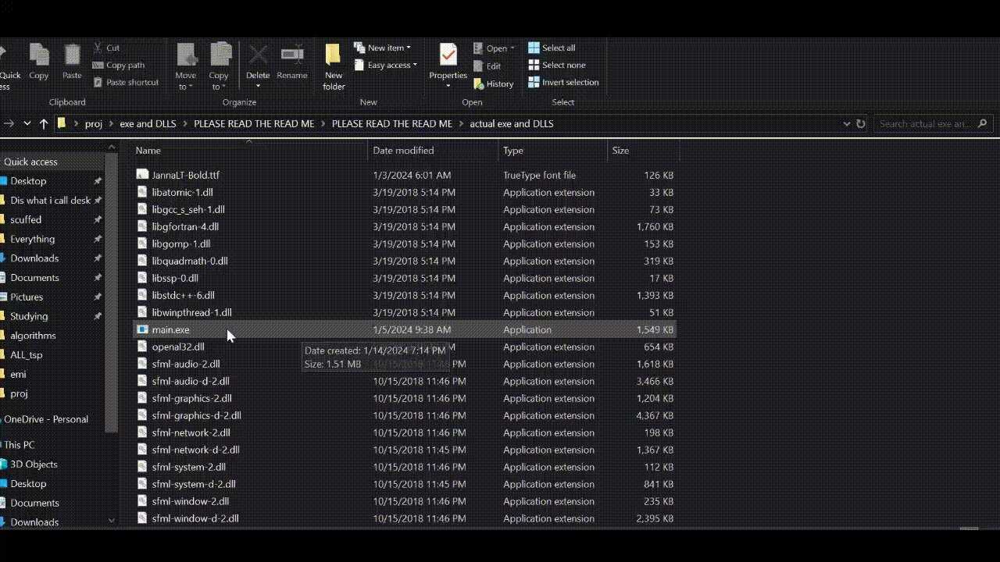

# Welcome!
Feel free to explore some of my projects.

# [Graduation Project](https://github.com/AhmedSayedOmar/Motion_prediction-team)

I worked on this graduation project at Purdue. Some needed context is that there is a race called the Indy Autonomous Race or IAC. The IAC is a race between between universities, each university is given a full sized formula style AV21 (recently AV24) vehicle. All cars are identical hardware wise. The vehicles are unmanned, and the difference is in the software to make the vehicles autonomous self driving. There is a full team of people working on Purdue's car and our graduation project was just a small part of that bigger team.

We worked on Motion Prediction of opponent vehicles, A Machine Learning project utilizing transformers on pre-trained models (module 1) and Gaussian Process for real time motion prediction (module 2). We also worked on Overtaking strategies and trajectories (module 3). I was more involved in the Motion Prediction aspect.

# [Full train reservation system](https://github.com/hamdiitarek/Train-Reservation-System)

This project was quite technical, although it may sound simple on paper, utilizing Data Structures and Algorithms, Database Design, and MYSQL, it is much more involved than that. Meticulous planning had to go into details like designing the map, such that all trains and routes meet at the correct times and that they satisfy fitting within a 24 hour window. We had to figure out an algorithm to find the best route, planning transfers from one train to another, and picking a different seat or preferably the same seat on the transfer train, somtimes two transfer trains even. All this passenger data, seating data, ticket data, ...etc had to be saved in our database so a good scheme was critical. The passenger can also pick between multiple routes deciding based off of stops, transfers, and price. We had to also figure out a mechanism for determening the price which depended on the route, time, and distance.

# [Exploring Factors Influencing Student Success](https://github.com/mohammed-alaa40123/Exploring-Factors-Influencing-Student-Success)

A Data Science project I completed during my junior year. The project's idea is to try to find a correlation and analyze the effect of factors, that may seem unrelated to grades, on students' success, or in our case, their GPAs. It involved quite a lot of data analysis before concluding any predictions. There was a lot of back and forth, like plotting outliers, determining required transformations, ...etc. All before starting to reach good results.

# [Maze Generator and Solver](https://github.com/abdelrahman-safwat/Maze-generator-and-solver)

Breifly, the project generates a maze and solves it. _**Demo gif is shown below!**_. The user first chooses the maze size, then the maze is generated. After that the user can pick the solving algorithm of his choice. The maze always starts at the top left corner and ends at the bottom right corner.

The project utilizes graph traversal and shortest path Algorithms, namely DFS, BFS, and A* with L1-norm heuristic. (Dijkstra was not used since the graph is unweighted). The project is fully coded in C++. All graphics are basically done from scratch. The library used for the graphics is SFML. Every single element drawn on screen is a rectangle, it is all rectangle manipulations in SFML.

